## Curso de Español

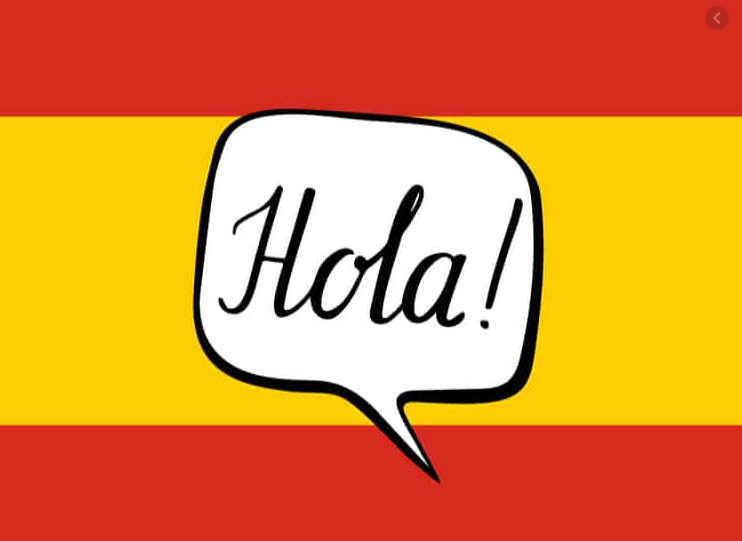

[Alberto Gregorio](https://albertogregorio.com)

---

## El Español en el mundo

"Spanish is the majority language in 21 sovereign states and several dependent territories, totaling around 440 million people."

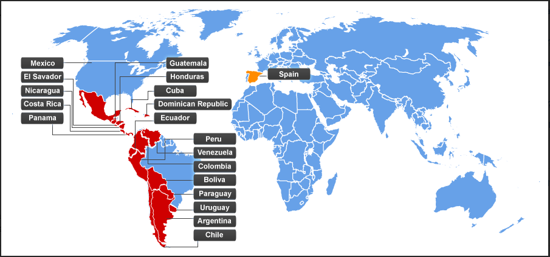

----

## Comunidades Autónomas (17 + 2)

Vamos a aprender español de España!

----

## Provincias (50)

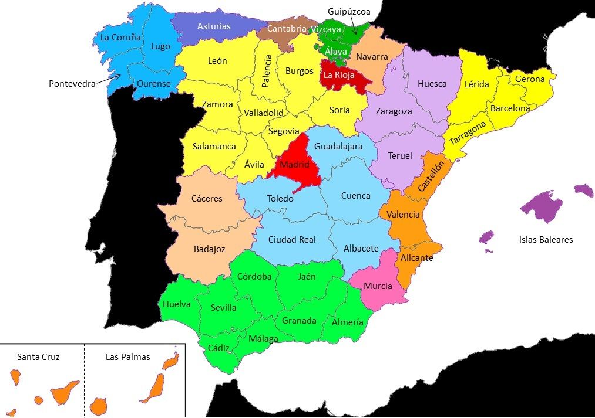

----

## Estereotipos (1)

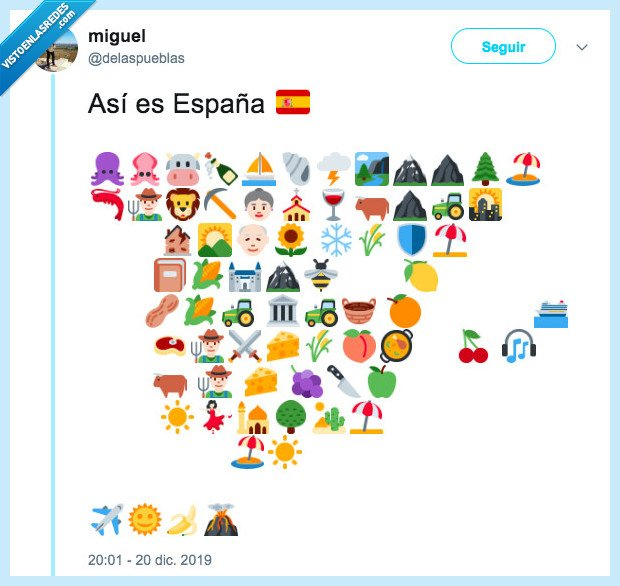

---

## El alfabeto

---

## Los Pronombres

----

## Los Pronombres (casos)

---

## Los números (0-20)

----

## Los números (21-100)

---

## Verbos (ser)

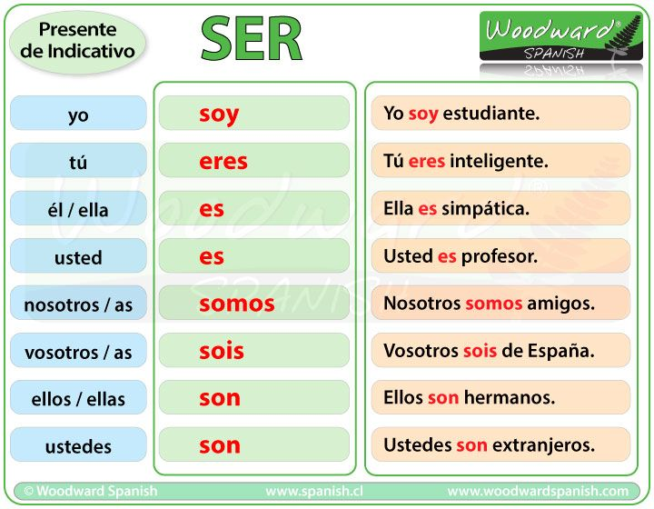

----

## Verbos (tener)

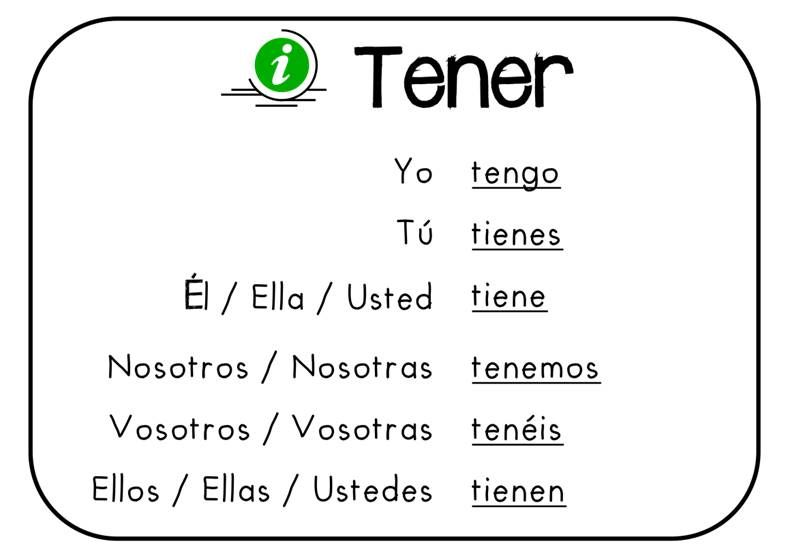

----

## Verbos (estar)

----

## Verbos (ser y tener)

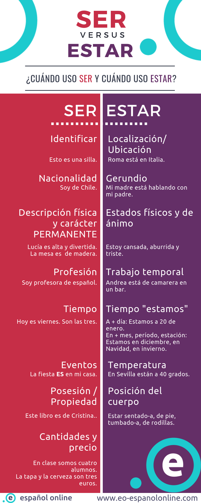 

---

## Género

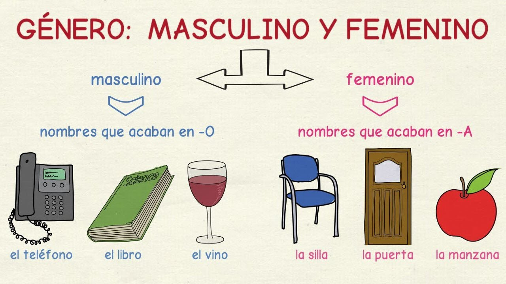

----

## Género y número

----

## Género (personas)

----

## Género (cosas)

----

## Género (frutas)

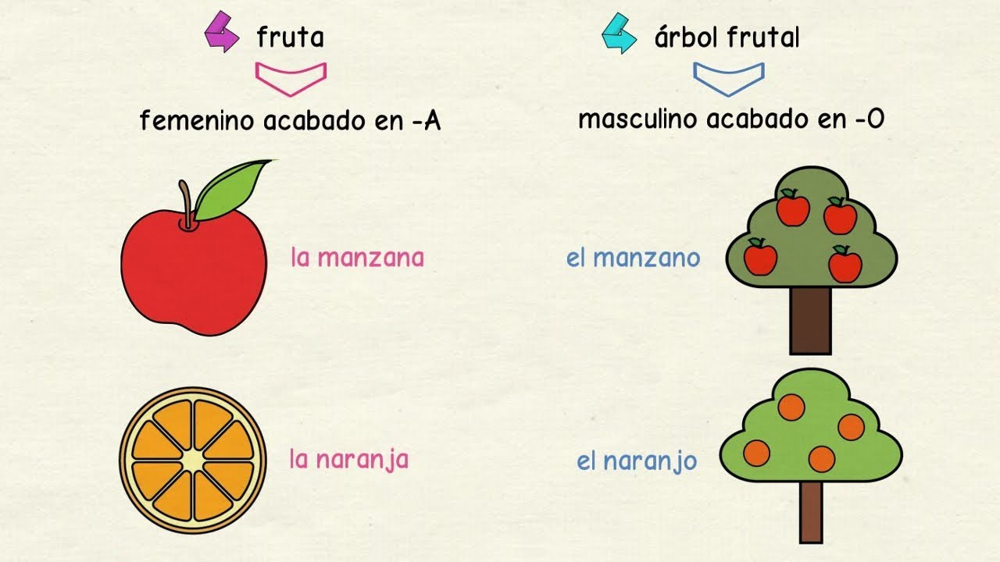

----

## Género (excepciones)

---

## Adjetivos (género y número)

SIEMPRE concuerdan con los nombres que acompañan en género (masculino o femenino) y número (singular o plural).

Mira el siguiente ejemplo:

* Laura tiene una casa preciosa en el campo. (fem. singular)
* Luis vive con tres perros preciosos en su casa del campo. (masc. plural)

Como puedes ver, el adjetivo PRECIOSO cambia si tiene delante una palaba femenina/masculina, o singular/plural.

----

## Adjetivos

También, existen adjetivos que no cambian de forma por género (masculino/femenino) sino solo por el número (singular/plural), como en el siguiente ejemplo:

– Ella es una estudiante muy inteligente. vs. Mis hermanas son muy inteligentes.
– Este chico es muy feliz. vs. Sus hermanos también son muy felices.

----

## Adjetivos (sin cambio de género)

A continuación, te indicamos una lista de los adjetivos que no cambian de género según su terminación:

– terminados en -e → obediente (niño obediente o niña obediente)
– terminados en -z → feliz (mujer feliz; hombre feliz)
– terminados en -a → hipócrita (Juan es un hipócrita. Ana es hipócrita)
– terminados en -i → marroquí (Amira es marroquí pero él no es marroquí)
– terminados en -u → hindú. (Lucas es hindú pero su madre no es hindú.)
– terminados en consonante → difícil, familiar, fácil. (Ana es familiar, Juan es familiar)
– cardinales → dos, tres, cinco. (cinco botellas; cinco libros).

----

## Adjetivos comunes (1)

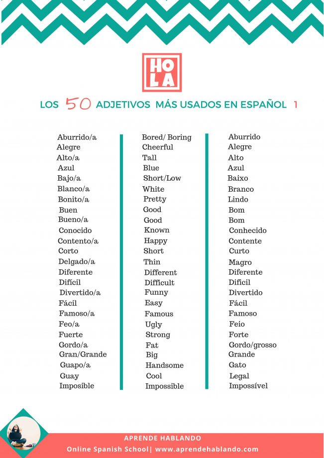

----

## Adjetivos comunes (2)

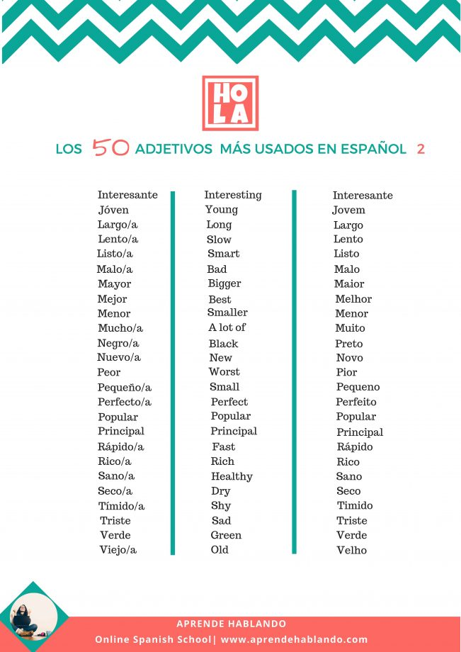

---

## Vocabulario (Familia)

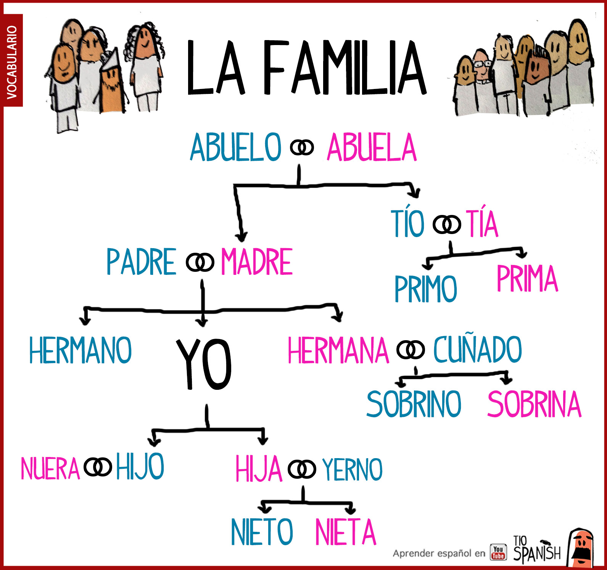