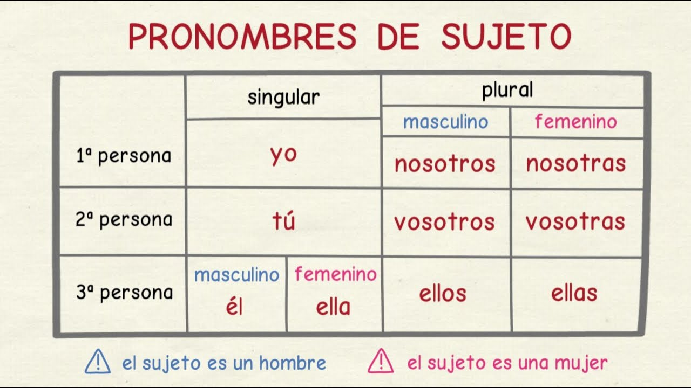
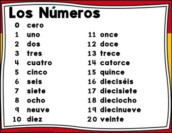

## Curso de Español

[Alberto Gregorio](https://albertogregorio.com)

---

## El Español en el mundo

"Spanish is the majority language in 21 sovereign states and several dependent territories, totaling around 440 million people."

----

## Comunidades Autónomas (17 + 2)

Vamos a aprender español de España!

----

## Provincias (50)

---

## El alfabeto

---

## Los Pronombres

----

## Los Pronombres (casos)

---

## Los números (0-20)

----

## Los números (21-100)

---

## Verbo tener

