### [Curso de Español](https://alberto.gregorio.pages.git.phios.li/curso-de-espa-ol/#/)

[Alberto Gregorio](https://albertogregorio.com)

---

## El Español en el mundo

"Spanish is the majority language in 21 sovereign states and several dependent territories, totaling around 440 million people."

Vamos a aprender español de España!

----

## El Español en el mundo

----

### Comunidades Autónomas (17 + 2)

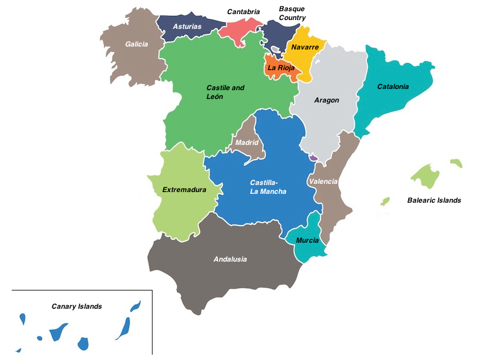

----

## Provincias (50)

----

## Estereotipos (1)

---

## El alfabeto

----

### Las letras

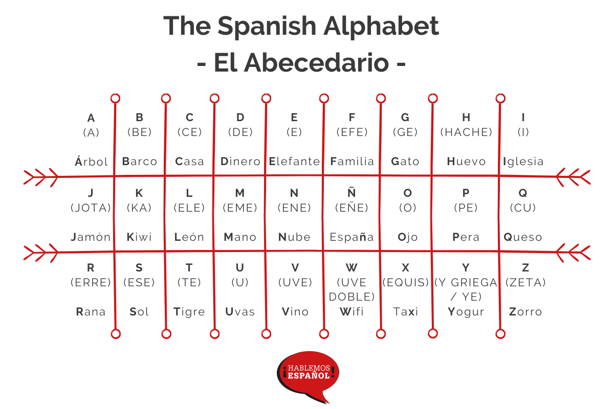

----

### Pronunciación

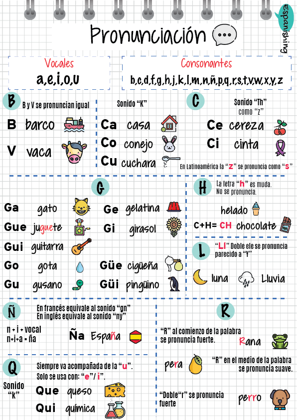

----

### Pronunciación (2)

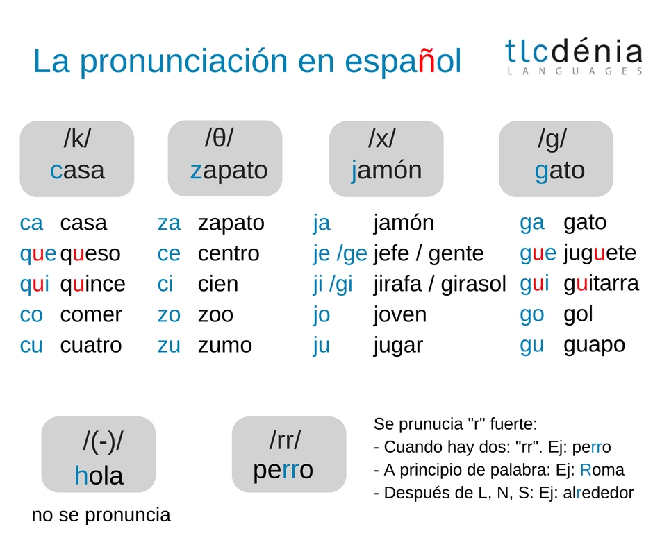

---

## Pronombres

----

### Los Pronombres

----

### Los Pronombres (casos)

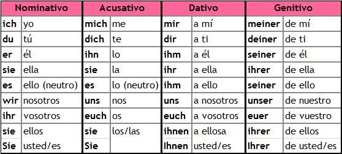

---

## N√∫meros

----

### Los n√∫meros (0-20)

----

### Los n√∫meros (21-100)

---

## Verbos

----

### Verbos (ser)

----

### Verbos (tener)

----

### Verbos (estar)

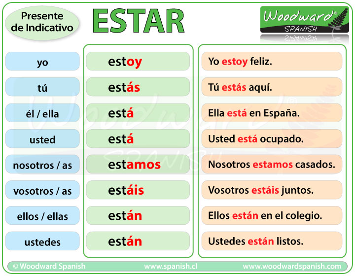

----

### Verbos (ser y estar) - Usos

 

----

### Verbos (ser y estar) - Ejercicios

[Link a los ejercicios](https://aprenderespanol.org/verbos/ser-estar.html)

----

### Verbos (gustar)

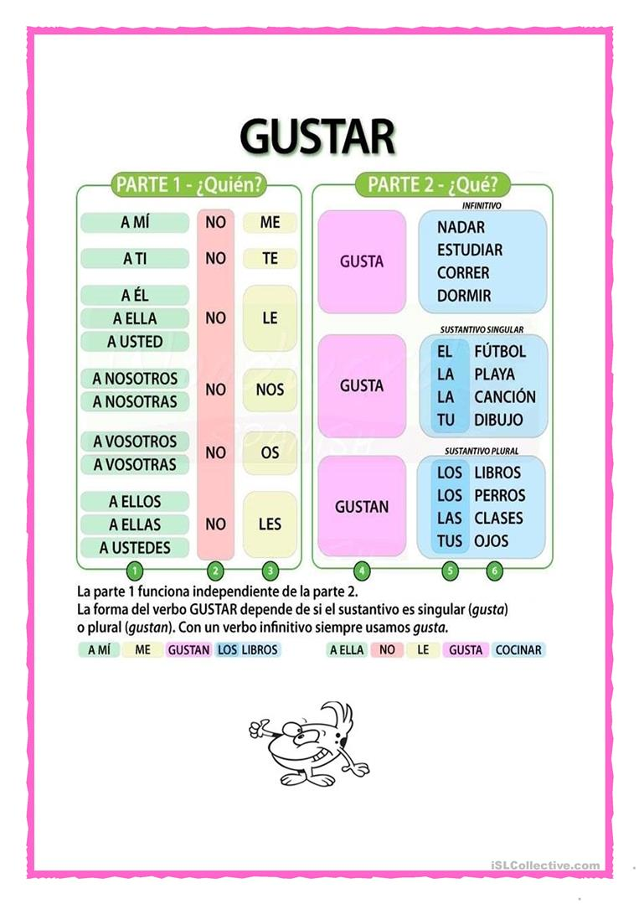

----

### Verbos (gustar - Ejercicios)

[Link a los ejercicios](https://www.spanishunicorn.com/ejercicios-con-el-verbo-gustar/)

----

### Verbos irregulares

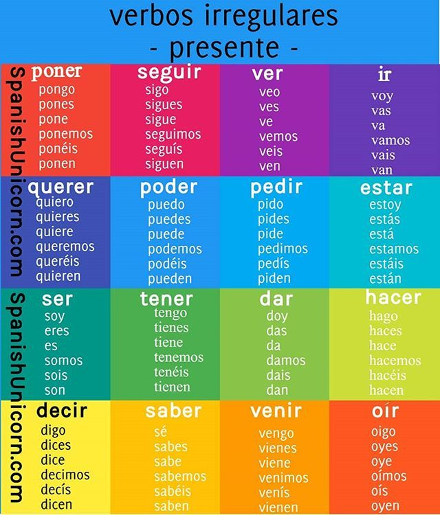

----

### Verbos m√°s usados

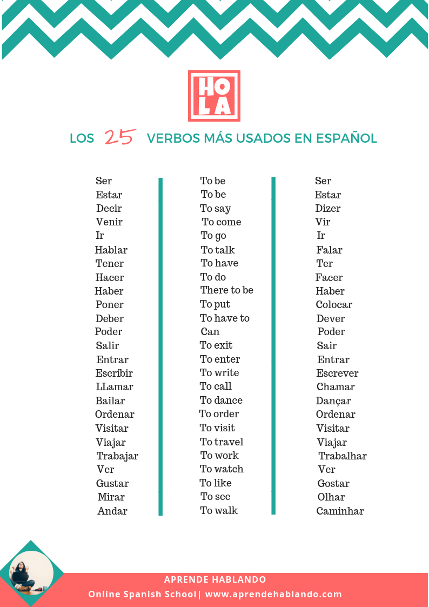

[Una lista mejor](https://lenguajeyotrasluces.com/2016/01/11/lista-de-verbos-mas-usados-en-espanol/)

---

## Conjugaciones *

----

### Presente de indicativo

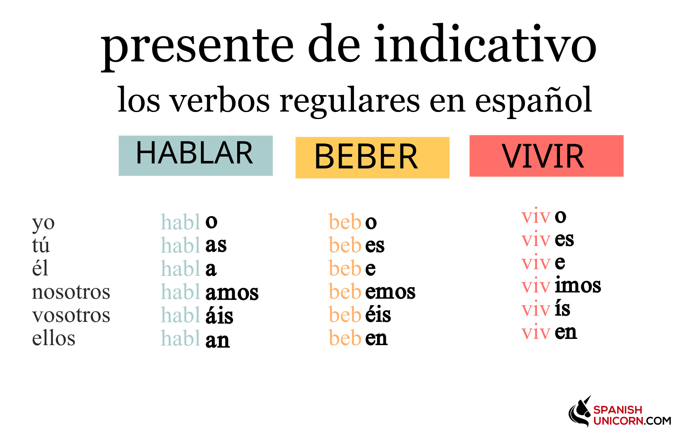

----

### Ejercicios (Conjugaciones en presente)

[ejercicio](https://www.spanishunicorn.com/verbos-regulares-en-espanol-ejercicios/)

---

## Género

----

### Masculino y Femenino

----

### Género y número

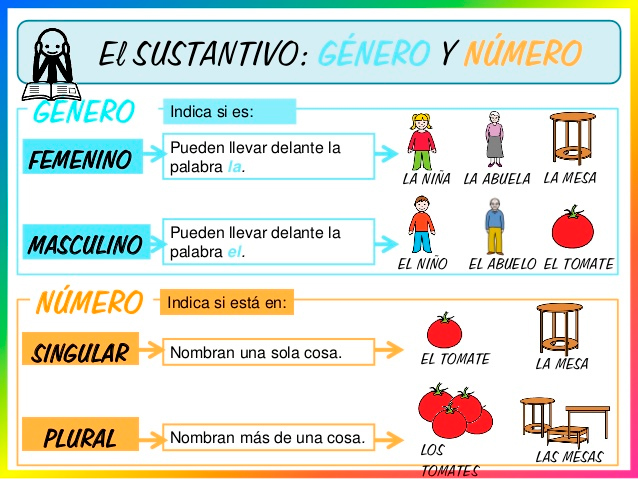

----

### Género (personas)

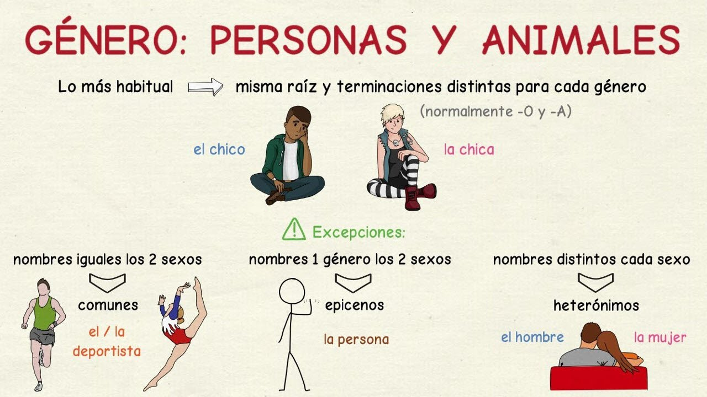

----

### Género (cosas)

----

### Género (frutas)

----

### Género (excepciones)

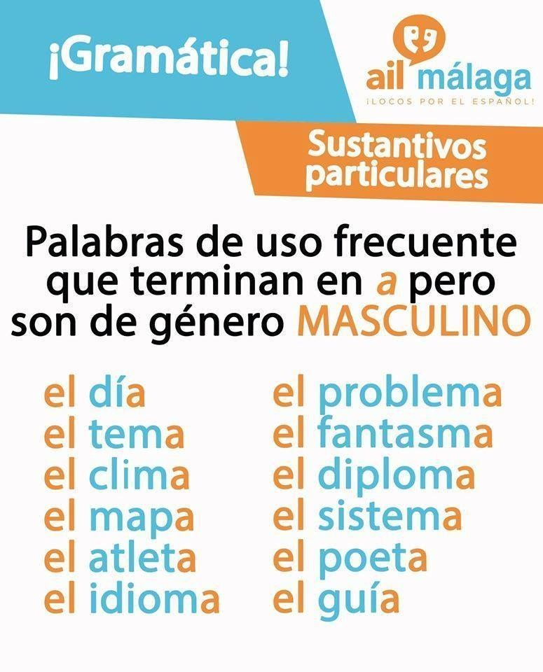

---

## El Tiempo

----

## Hora y fecha

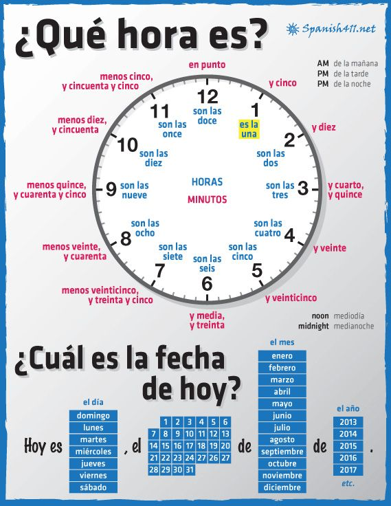

----

## Los meses

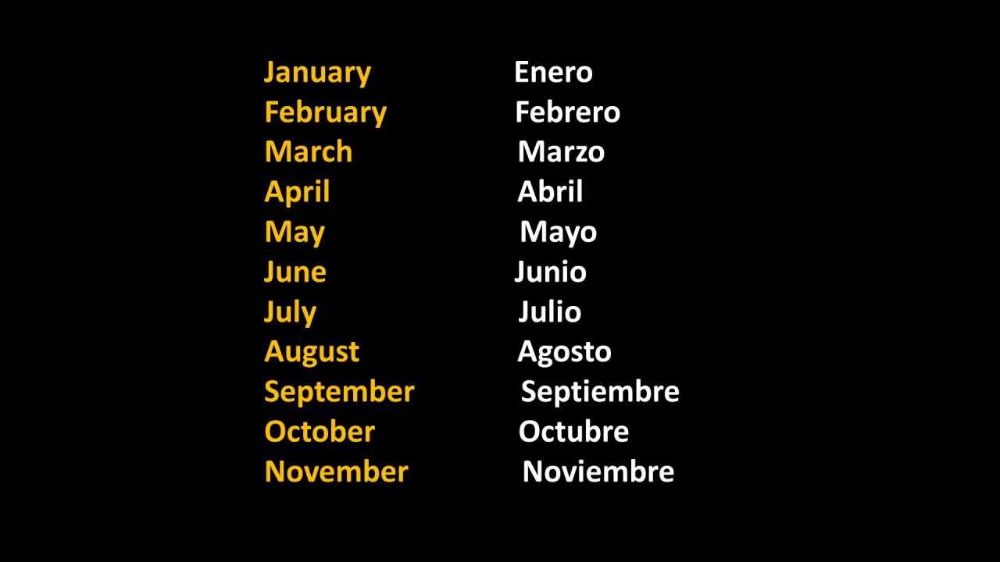

----

## Adverbios temporales

----

## Adverbios de frecuencia absoluta

- (casi) siempre - (fast) immer
- la mayoría de las veces - meistens
- la mayoría de las veces - normalarweise
- frecuentemente - häufig
- frecuentemente - oft
- en ocasiones - ab und zua veces - manchmal
- pocas veces - selten
- (casi) nunca - (fast) nie

----

### Adverbios de frecuencia diaria

- por las mañanas - morgens
- por las tardes (después de comer) - nachmittags
- por las tardes - abends
- por las noches - nachts

----

### Adverbios de frecuencia semanal

- los lunes - montags
- los martes - dienstags
- los miércoles - mittwochs
- los jueves - donnerstags
- los viernes - freitags
- los s√°bados - samstags
- los domingos - sonntags

----

### Otros Adverbios de frecuencia

- diariamente - täglich
- semanalmente - wöchentlich
- mensualmente - monatlich
- anualmente - jährlich

---

## Acentuación

----

### Acentos

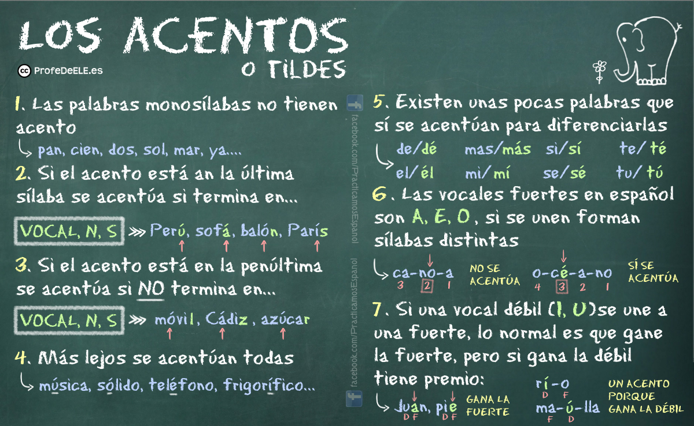

----

### Tilde diacrítica

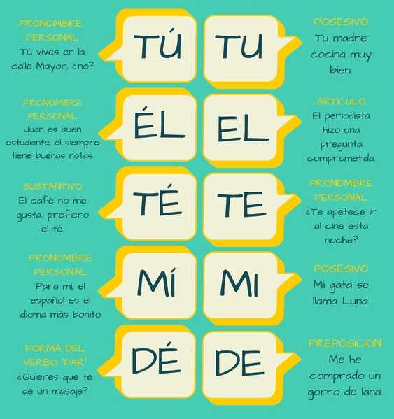

----

### Diptongos e hiatos

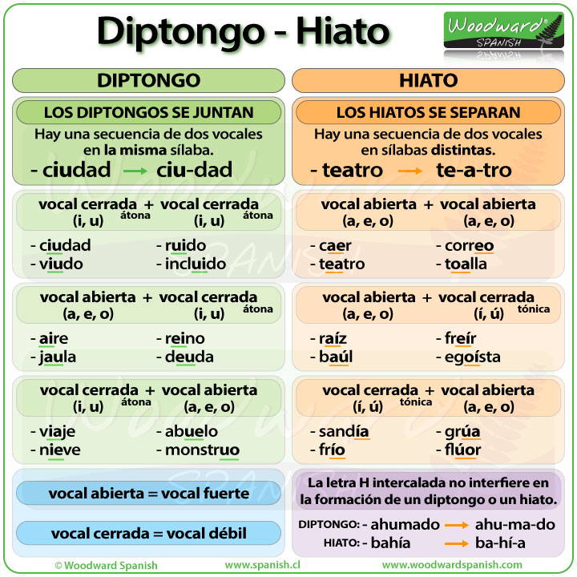

---

## Adjetivos

----

### Género y número

SIEMPRE concuerdan con los nombres que acompañan en género (masculino o femenino) y número (singular o plural).

----

### Adjetivos (ejemplo)

* Laura tiene una casa **preciosa** en el campo. (fem. singular)
* Luis vive con tres perros **preciosos** en su casa del campo. (masc. plural)

⚠ El adjetivo **PRECIOSO** cambia si tiene delante una palaba femenina 👧/masculina 👦, o singular 👦/ plural 👪.

----

### Adjetivos

También, existen adjetivos que no cambian de forma por género (masculino/femenino) sino solo por el número (singular/plural)

* Ella es una estudiante muy **inteligente**
* Mis hermanas son muy **inteligentes**
* Este chico es muy **feliz**
* Sus hermanos también son muy **felices**

----

### Adjetivos (sin cambio de género)

A continuación, te indicamos una lista de los adjetivos que no cambian de género según su terminación:

* terminados en -e → obediente (niño obediente o niña obediente)
* terminados en -z ‚Üí feliz (mujer feliz; hombre feliz)
* terminados en -a → hipócrita (Juan es un hipócrita. Ana es hipócrita)

----

### Adjetivos (sin cambio de género 2)

* terminados en -i → marroquí (Amira es marroquí pero él no es marroquí)
* terminados en -u ‚Üí hind√∫. (Lucas es hind√∫ pero su madre no es hind√∫.)
* terminados en consonante → difícil, familiar, fácil. (Ana es familiar, Juan es familiar)
* cardinales ‚Üí dos, tres, cinco. (cinco botellas; cinco libros).

----

### Adjetivos comunes (1)

----

### Adjetivos comunes (2)

---

## Vocabulario

----

### Vocabulario (Familia)

----

### Vocabulario (Ropa 1)

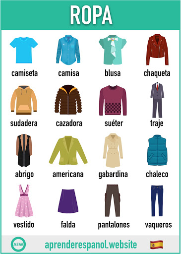

----

### Vocabulario (Ropa 2)

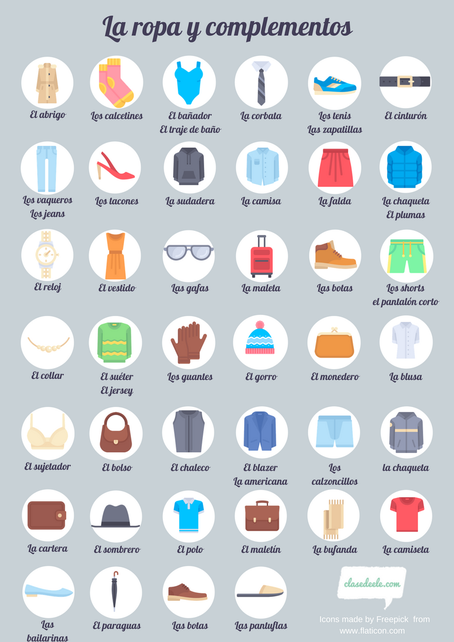

----

### Vocabulario (Frutas)

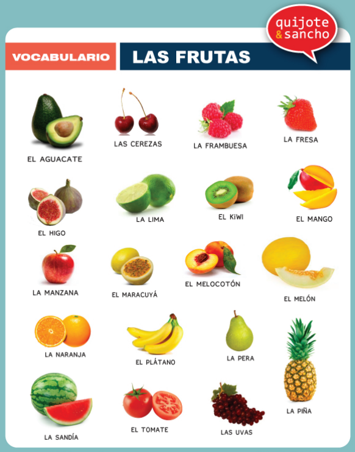

----

### Vocabulario (Colores)

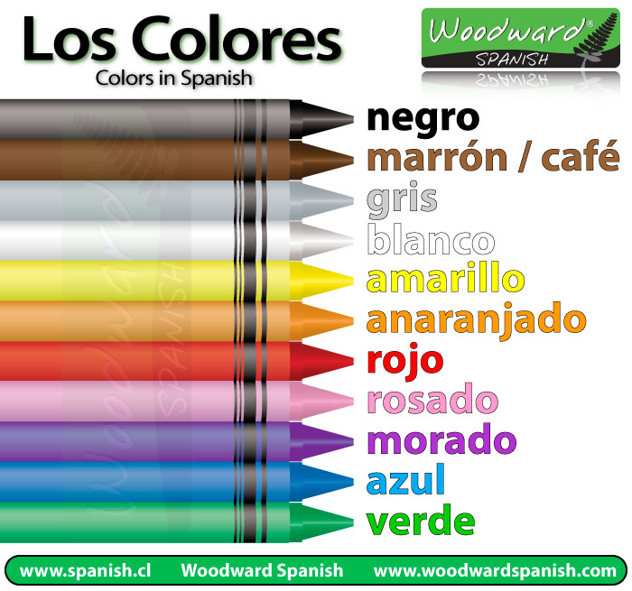

---

## Dictados *

----

## Mam√° fontanera

[Texto (P√°gina 13)](https://agora.xtec.cat/afapremia/wp-content/uploads/usu1270/2016/06/EDUCACION-PERMANENTE-90-LECTURAS.pdf)

---

## Direcciones * 

----

### Direcciones b√°sicas

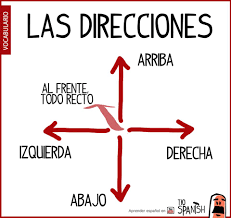

----

### Edificios

----

### Medios de transporte

----

### Pedir direcciones

----

### Indicar direcciones

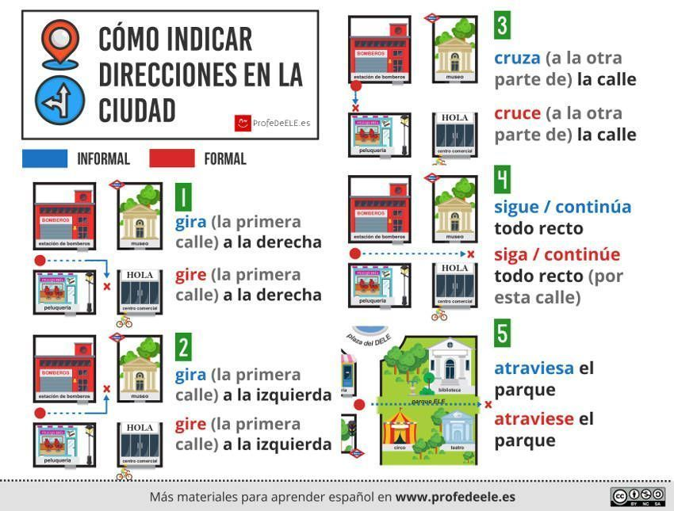

----

### Ejemplo ciudad

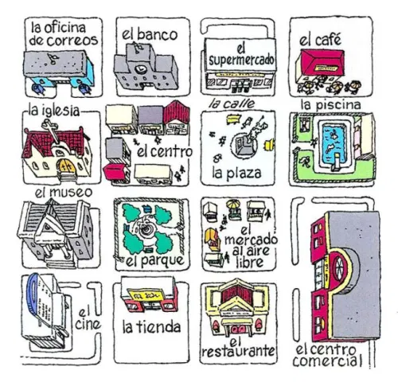

---

## Presentación

----

### Presentación (preguntas)

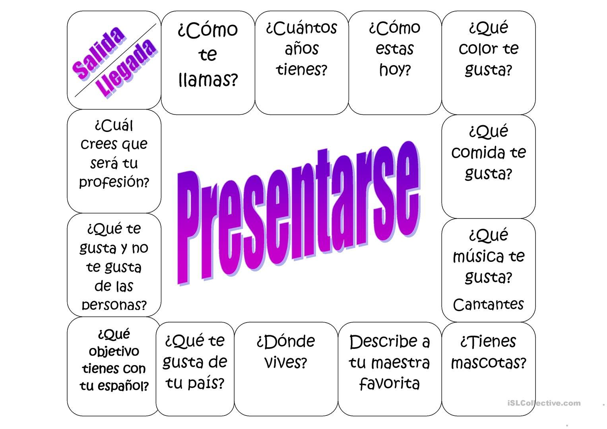

----

### Presentación (ejemplo)

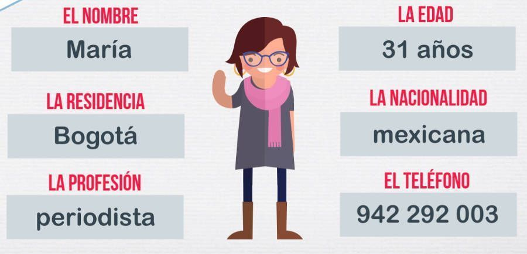

----

### Presentación (ejercicio)

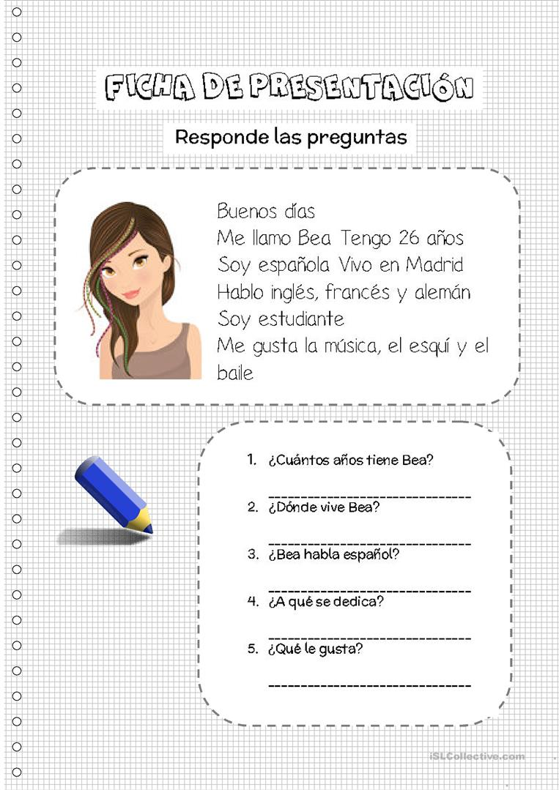

---

## Descripción

----

### Descripción física

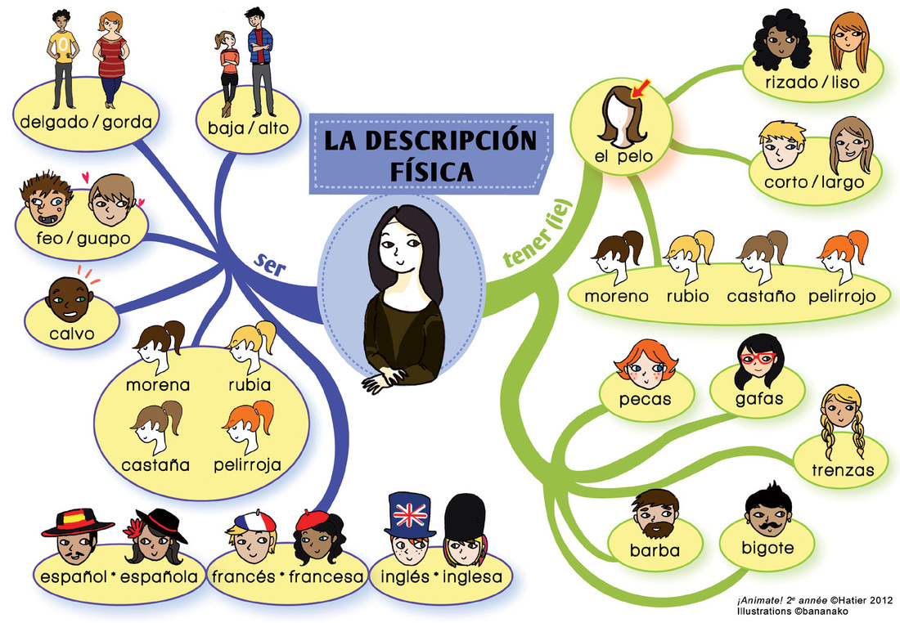

----

### Descripción física (2)

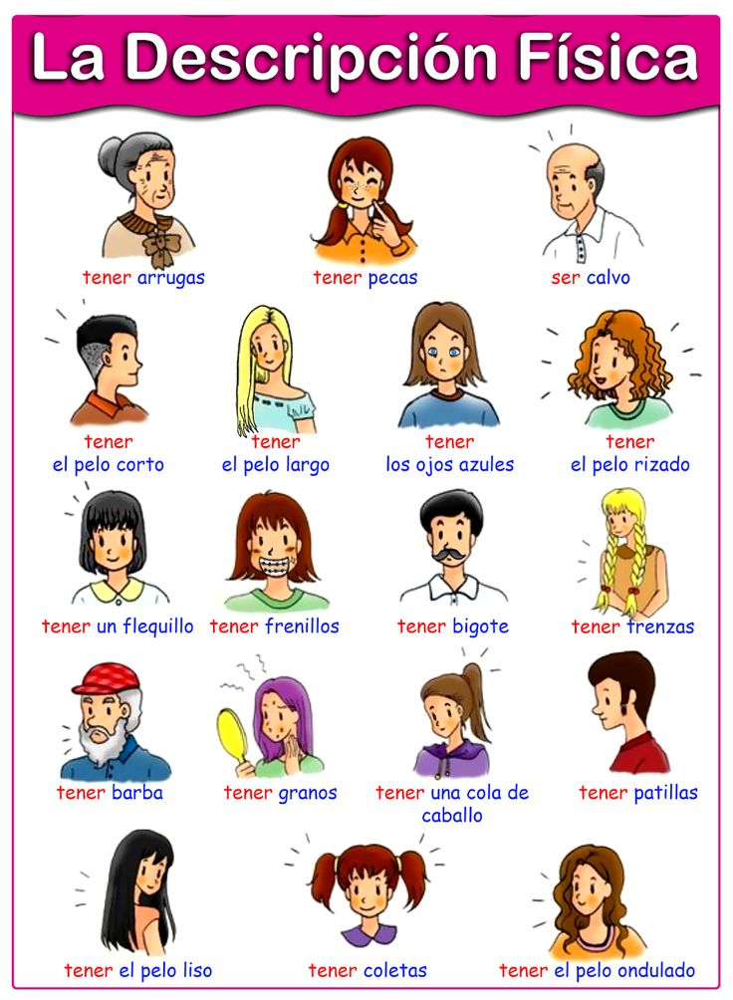

----

### Descripción de personalidad

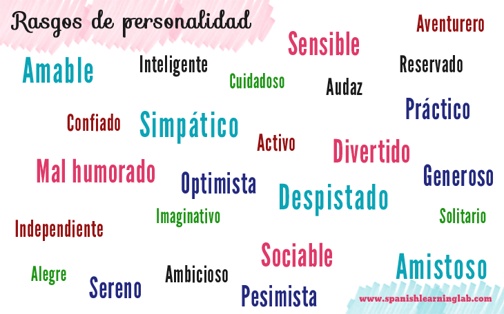

----

### Descripción de personalidad (2)

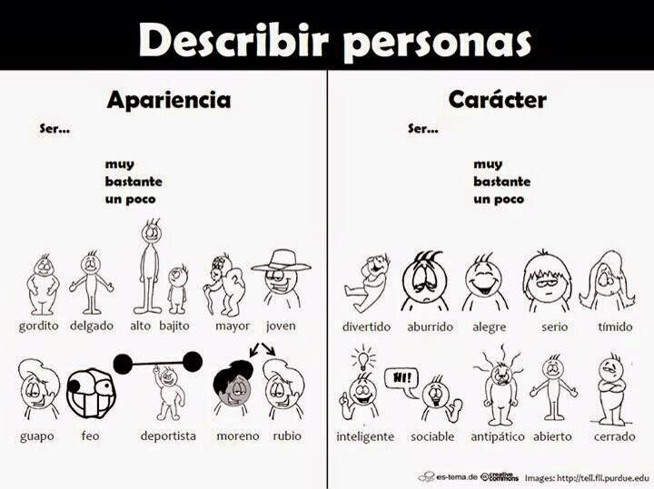

----

### Descripción (ejercicio)

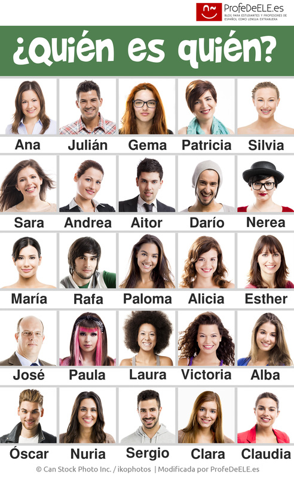

---

## Recomendaciones *

----

### Podcasts

- [Hoy Hablamos](https://www.hoyhablamos.com)
- [Notes in spanish](https://www.notesinspanish.com/)

----

### Películas

- []
